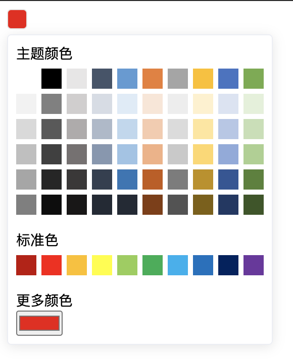

# 颜色选择器

## 使用方法

```javascript
import Vue from 'vue'
import XColorPicker from '@xuanmo/vue-color-picker'
Vue.use(XColorPicker)
```

```html
<x-color-picker v-model="color" />
```

## props

|字段名|说明|类型|默认值
|---|---|---|---|
|v-model(value)|获取选中颜色|string|#000000|

## events

|事件名|说明|回调参数
|---|---|---|
|change|颜色值发生改变时触发|color|

## 示例

